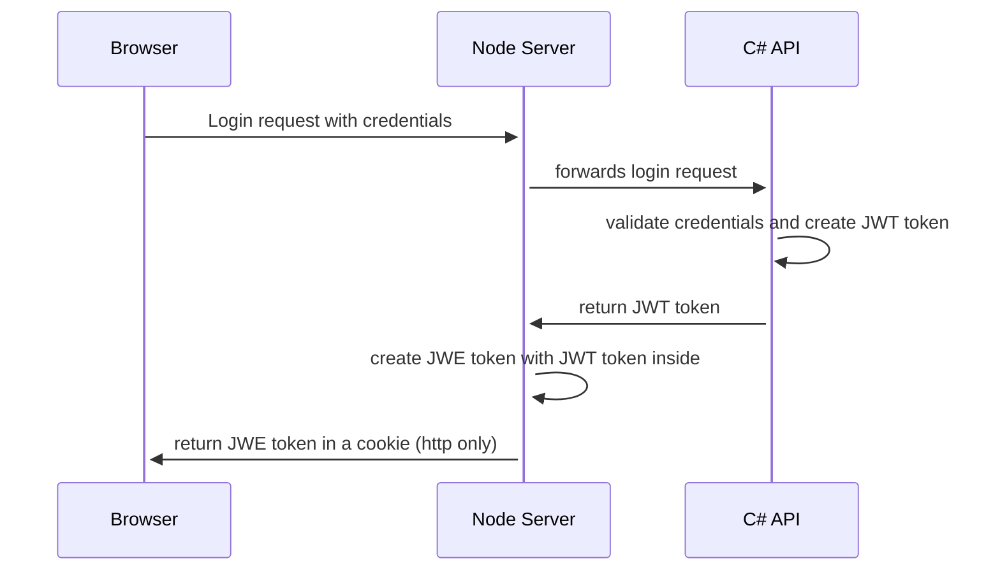
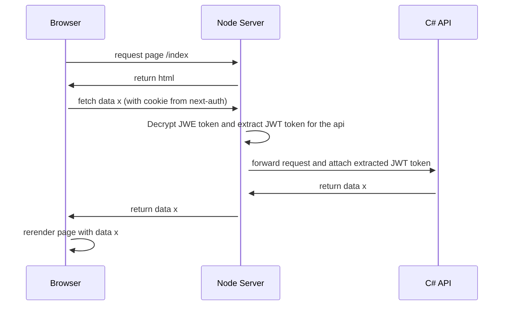
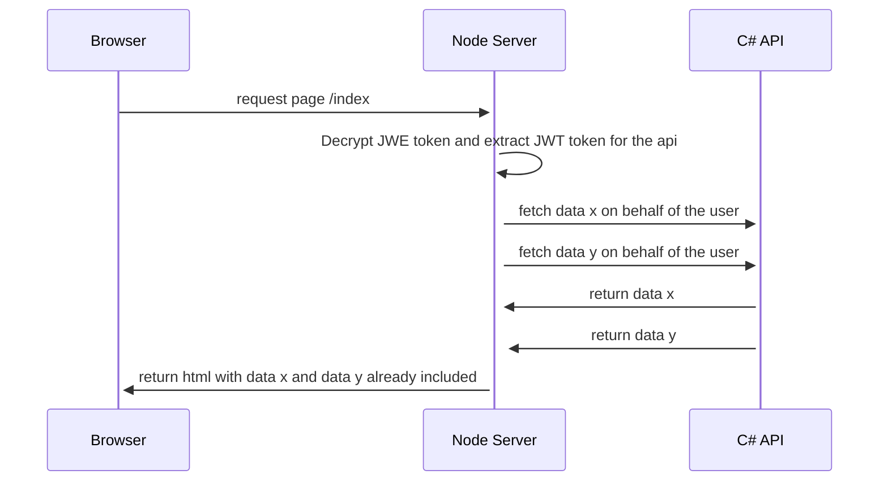
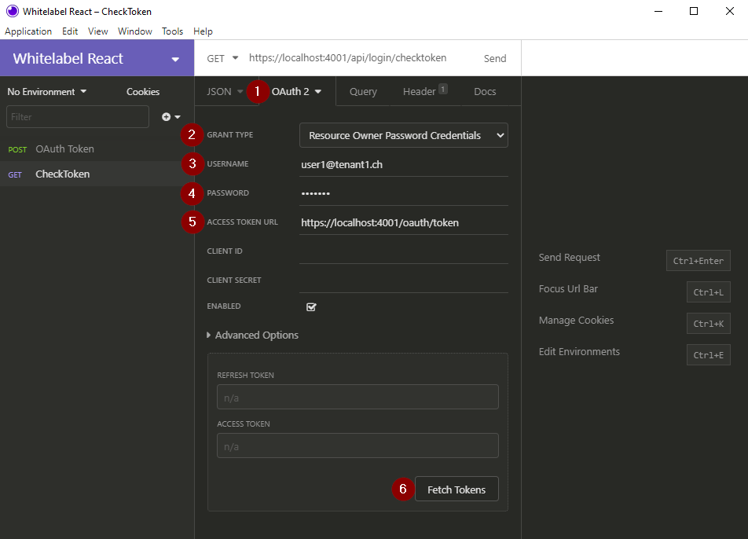
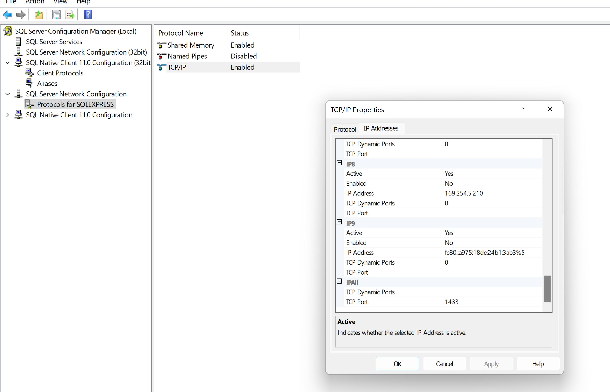

# Introduction

Sample React project

## System Overview

The system contains 3 main components:

- The browser
- The node server
- The C# API

The main technolgoies used are:

- React
- Next.js
- Node.js
- C#

We use [next-auth](https://next-auth.js.org/) to handle the authentication. Next-auth is a complete authentication solution for Next.js applications. It is easy to use and supports many different authentication providers like Azure AD, Google, Facebook, Twitter, etc. It also supports custom authentication providers. We use a custom provider to authenticate the user against our C# API.

It's important to understand that next-auth has two places to store data:

- JWE token in a cookie:
  - JWE is an encrypted JWT token. Although it's send to the browser (user) it can't be read by the user. It's encrypted with a secret that is only known by the node server.
- Session:
  - Session is basically a method living on the node server exposing certain parts of the JWE token. It's used to supply data to the browser (user) that needs to be accessible on the client side. For example the user name or the user role.

The C# API has it's on JWT token used for authentication. That's why we store the JWT token from the C# API inside the JWE token.

A typical login flow looks like this:



The C# API is only called from the node server. There are no direct calls from the browser to the C# API. We do this because we use next-auth to authenticate the user. The secret used to sign the JWT token is only known by the node server. If we would call the C# API directly from the browser, we would have to share the JWT token with the browser. This would be a security risk, especially because we would need to make this cookie accessible by the browser (no http only flag).

To fetch data there are two possibilities:

Fetch data in a `useEffect` hook on the client side. In this scenario the basic web page is already sent to the browser and the data is fetched afterwards. This is the preferred way to fetch data. It's also the way how next.js recommends to fetch data. Because we don't care about SEO we can use the `useEffect` hook to fetch data. If we would care about SEO we would need to use the `getServerSideProps` function. This function is executed on the server side and the data is already available when the page is sent to the browser.

Fetch data in a `useEffect`:



Fetch data in a `getServerSideProps`:



## Debugging the solution

Describe how to debug

### Debug the API

One popular possiblity is using a REST client like [Insomnia](https://insomnia.rest) or [Postman](https://www.postman.com) to make requests to the API.

The API uses the [Resource Owner Password Credentials](https://tools.ietf.org/html/rfc6749#section-4.3) flow, specified in the OAuth 2.0 protocol. This allows you to enter your credentials directly in the requests of your REST client and you do not have to make a separate auth request to get your access token, because it will be fetched and renewed automatically.



1. Choose `OAuth 2` as your auth method.
2. Choose `Resource Owner Password Credentials` as the grant type. Your client could also use the term `Password Grant` instead.
3. Enter your username or email
4. Enter your password
5. Enter the URL where the access token can be requested. Usually it is `{YourAppBaseUrl}/oauth/token`.
6. (Optional) Make a test auth request to check if you can get the access token.

## Development with VSCode

Describe how to start

## Build & Deploy

Describe how to deploy into test and production

## Docker

### Build Docker Container on Windows

Below the commands that are used to build the docker container locally on windows:

- Change to directory `cd Pedalo.UI.API`
- `dotnet restore --packages ../.nuget` (needs only to be run once - this is made to get the neolution nugets from our feed without auth)
- `docker build -t pedalo-api:latest .. -f Dockerfile`

Run container: `docker run --rm -it pedalo-api:latest`
Run container but land in bash for debug: `docker run --rm -it --entrypoint="/bin/bash" pedalo-api:latest`
Run container Dev: `docker run --rm -it pedalo-api:latest -e ASPNETCORE_ENVIRONMENT="Development"`

### Cleanup Docker diskspace on Windows

To view the current space used, run `docker system df` for cleaning up run these commands

- `docker system prune -a --filter label!=do-not-remove`

In powershell start (vm-name or path my be different)

- `Stop-VM DockerDesktopVM`
- `Optimize-VHD -Path "C:\ProgramData\DockerDesktop\vm-data\DockerDesktop.vhdx" -Mode Quick`
- `Start-VM DockerDesktopVM`

## Google Cloud Setup

Following part describes how to setup everything in google cloud plattform (GCP).

### Setup project

Open <https://console.cloud.google.com> => Project => New Project

- ProjectId: pedalo
- Organization: neolution.ch
- Location: neolution.ch

After this switch to CloudRun (left main navigation) and click Create Service. This initializes the service. You can cancel here and don't need to do anything right now.

### Create Service Account for Azure Pipeline to deploy container

In the webbrowser run `Google Cloud shell` (top right).

Tip: You can enable copy paste by clicking on the gear icon -> Terminal Preferences -> Copy Settings -> Copy/paste with Ctrl+Shift+C/V

Execute following steps

- Set environmentvariable as project name `PROD_PROJECT_ID=pedalo`
- Enable containerservices: `gcloud services enable containerregistry.googleapis.com`
- Add service account: `gcloud iam service-accounts create azure-pipelines-publisher --display-name="Azure Pipelines Publisher" --project=$PROD_PROJECT_ID`
- Give permission to the new service account. Run these 2 commands

  ```bash
  AZURE_PIPELINES_PUBLISHER=azure-pipelines-publisher@$PROD_PROJECT_ID.iam.gserviceaccount.com

  gcloud projects add-iam-policy-binding $PROD_PROJECT_ID --member serviceAccount:$AZURE_PIPELINES_PUBLISHER --role roles/storage.admin --project=$PROD_PROJECT_ID
  ```

- Then create the json file with the permissions which we need in azure devops `gcloud iam service-accounts keys create azure-pipelines-publisher.json --iam-account $AZURE_PIPELINES_PUBLISHER --project=$PROD_PROJECT_ID`
- Move all contents to a single line `tr -d '\n' < azure-pipelines-publisher.json > azure-pipelines-publisher-oneline.json`
- Switch to the filebrowser (click `Open Editor`) and download the `azure-pipelines-publisher-oneline.json` file.

Now give permission to that account that we can make CloudRun deployments (<https://cloud.google.com/run/docs/reference/iam/roles#gcloud>)

- Give `roles/run.admin` permission to the pipeline user with the following command:
  `gcloud projects add-iam-policy-binding $PROD_PROJECT_ID --member=serviceAccount:azure-pipelines-publisher@$PROD_PROJECT_ID.iam.gserviceaccount.com --role='roles/run.admin'`
- Give `iam.serviceAccounts.actAs` permission to the user through the following command. The PROJECT_ID-compute number can be found if you switch to IAM (found in the left navigation) and look for the \*-computer user. Replace it here:
  `gcloud iam service-accounts add-iam-policy-binding PROJECT_ID_REPLACEME-compute@developer.gserviceaccount.com --member="serviceAccount:azure-pipelines-publisher@$PROD_PROJECT_ID.iam.gserviceaccount.com" --role="roles/iam.serviceAccountUser"`

### Azure DevOps Pipeline

In order to give DevOps permission to deploy containers or new versions, we need to make following changes

- Devops > open your proejct > Project settings (bottom left) > Service connections > New serivce connection
- Docker registry: https://eu.gcr.io/pedalo
- Docker ID: \_json_key
- Docker password: content from `azure-pipelines-publisher-oneline.json`
- Service Connection name: googlecontainerregistry

Create `gcloud.json` required for the pipeline to deploy new versions to GCP.

- DevOps -> Pipelines -> Library -> Secure files
- Click add secure file. Upload the `azure-pipelines-publisher-oneline.json` from earlier. rename it before to `gcloud.json`

We also need to configure the connectionstring as variable in the pipeline. When you have created the CD pipeline in Azure DevOps select `Edit Pipeline` on top right then click on the `Variables` button. Add a new variable

- Name: TestDbConnectionString
- ConnectionString: your connectionstring to your test database
- Check: Keep this value secret

### Install CloudRun services

After you have made the described steps and executed the pipeline you need to create the CloudRun services. For this open the google console in your browser. Navigate to CloudRun and selecte `Create service`

- Deployment plattform: Cloud Run (fully managed)
  - Region: europe-west4 (Netherlands)
- Service name: pedalo-client
- Container Url: eu.gcr.io/pedalo/pedalo_client:latest-develop
- Open show advanced settings
  - Container port: 80
  - Autoscaling: max number instances: 2
- Switch to Variables tab
  - Add all your environment variables
- Authentication: Allow unauthenticated invocations

After this repeat the steps for the service name pedalo-api. And then repeat all the steps for the test environment. Name services pedalo-test-api and pedalo-test-client.

### Setup static outbound ip address

To have a static outbound address (which we can then use for example in the azure portal to access the SQL server) we have to configure a few things.

Reference: https://cloud.google.com/run/docs/configuring/static-outbound-ip

- In the webbrowser run `Google Cloud shell` (top right).

- Set the proejct id as env variable:

  ```
  PROD_PROJECT_ID=pedalo
  ```

- The ip address hast to be in the same region as the cloud services so set it with this env variable accordingly:

  ```
  REGION=europe-west6
  REGION=europe-west4
  ```

- `gcloud compute networks list` to find the network. Usually the name will be `default`

- ```
  gcloud compute networks subnets create outbound-subnet \
    --range=10.124.0.0/28 \
    --network=default \
    --region=$REGION
  ```

- ```
  gcloud beta compute networks vpc-access connectors create outbound-connector \
    --subnet-project=$PROD_PROJECT_ID \
    --subnet=outbound-subnet \
    --region=$REGION

  Answer yes if it asks you to create the needed entities.
  ```

- ```
  gcloud compute routers create outbound-router \
    --network=default \
    --region=$REGION
  ```

- ```
  gcloud compute addresses create static-outbound --region=$REGION
  ```

- ```
  gcloud compute routers nats create outbound-nat \
    --router=outbound-router \
    --region=$REGION \
    --nat-custom-subnet-ip-ranges=outbound-subnet \
    --nat-external-ip-pool=static-outbound
  ```

- You can view your static ip by going to `VPC network` -> `External IP addresses` in the left menu toolbar.

  ```
  gcloud compute addresses describe static-outbound \
      --format="get(address)" \
  	--region=$REGION
  ```

- Go to your cloud run and select the service that you want to have an outbound static ip

  - Edit and deploy new version

  - Connections

  - In the VPC Connector dropdown select `outbound-connector`

  - Select "Route all traffic through the VPC connector"

  - Hit deploy.

  - To test it you can make a request from your application to http://curlmyip.org/

    ```c#
      private static async Task<string> CurlMyIpAsync()
      {
          var baseUrl = new Uri("http://curlmyip.org");

          using (HttpClient client = new HttpClient())
              using (HttpResponseMessage res = await client.GetAsync(baseUrl))
              using (HttpContent content = res.Content)
          {
              string data = await content.ReadAsStringAsync();
              if (data != null)
              {
                  return data;
              }
          }

          return string.Empty;
      }
    ```

### Set up custom Domain

Because europe-west6 (Zurich) does not support custom domains, we need to setup a custom external load balancer to solve the problem.

Reference: https://cloud.google.com/load-balancing/docs/https/setting-up-https-serverless

- First set the environment variable `SERVICE_NAME` to the service you would like to create the load balancer for. You can find the name here: https://console.cloud.google.com/run?cloudshell=true

- SSL_DOMAIN is only needed if you want to use https:

  ```
  SERVICE_NAME=your-service-name-here
  SSL_DOMAIN=your-domain-here
  ```

- ```
  gcloud compute addresses create static-inbound-$SERVICE_NAME \
      --ip-version=IPV4 \
      --global
  ```

- ```
  gcloud compute network-endpoint-groups create endpoint-group-$SERVICE_NAME \
      --region=europe-west6 \
      --network-endpoint-type=serverless  \
      --cloud-run-service=$SERVICE_NAME
  ```

- ```
  gcloud compute backend-services create backend-$SERVICE_NAME \
      --global
  ```

- ```
  gcloud compute backend-services add-backend backend-$SERVICE_NAME \
      --global \
      --network-endpoint-group=endpoint-group-$SERVICE_NAME \
      --network-endpoint-group-region=europe-west6
  ```

- ```
  gcloud compute url-maps create load-balancer-$SERVICE_NAME \
      --default-service backend-$SERVICE_NAME
  ```

- ```
  gcloud compute target-http-proxies create http-proxy-$SERVICE_NAME \
      --url-map=load-balancer-$SERVICE_NAME
  ```

- ```
  gcloud compute forwarding-rules create forwarding-rule-$SERVICE_NAME \
      --address=static-inbound-$SERVICE_NAME \
      --target-http-proxy=http-proxy-$SERVICE_NAME \
      --global \
      --ports=80
  ```

- If you want to use HTTPS as well:

  ```
  gcloud beta compute ssl-certificates create certificate-$SERVICE_NAME \
  	--project=pedalo \
  	--global \
  	--domains=$SSL_DOMAIN
  ```

  ```
  gcloud compute target-https-proxies create https-proxy-$SERVICE_NAME \
      --ssl-certificates=certificate-$SERVICE_NAME \
      --url-map=load-balancer-$SERVICE_NAME
  ```

  ```
  gcloud compute forwarding-rules create forwarding-rule-https-$SERVICE_NAME \
      --address=static-inbound-$SERVICE_NAME \
      --target-https-proxy=https-proxy-$SERVICE_NAME \
      --global \
      --ports=443
  ```

- To get the static ip you can run the following command:

  ```
  gcloud compute addresses describe static-inbound-$SERVICE_NAME \
      --format="get(address)" \
      --global
  ```

#### Adding additional domains / certificates

To add additional domains / certificates you have to first create the certificate and afterwards assign it to the forwarding rule:

- ```
  SERVICE_NAME=your-service-name-here
  SSL_DOMAIN=your-domain-here
  CERTIFICATE_NAME=your-certificate-name-here

  gcloud beta compute ssl-certificates create certificate-$SERVICE_NAME-$CERTIFICATE_NAME \
  	--project=pedalo \
  	--global \
  	--domains=$SSL_DOMAIN
  ```

- In the left menu toolbar go to **Network Services** --> **Load Balancing**

  - Click on the load balancer
  - Click Edit
  - Click Frontend configuration
  - Click the edit pen icon on the HTTPS rule
  - Click additional certificates and add the created certificate
  - Click update
  - You should see the certificates now in the certificate column. If not try to repeat the process. It sometimes tends to not work on the first try, maybe a bug in google cloud platform.

### SQL User Permissions

The web application will access with a restricted user. The following script contains the creation and permissions for the web user that are required to run the application. It assumes the username is `pedalo01`

## Database migrations

You need to install the Entity Framework Core CLI tools with

`dotnet tool install --global dotnet-ef`

and verify that are correctly installed

`dotnet ef`

Since the solution is splitted in multiple project, we have to specify which one is the "target project" and which is the "startup project" (https://docs.microsoft.com/en-us/ef/core/cli/dotnet#target-project-and-startup-project)

There is a little helper file called `ef.bat` and `ef.sh` (for linux systems) which calls the `dotnet ef` command with the target and startup project already specified:

```
@echo off
dotnet ef --project Pedalo.Infrastructure %*
```

So for example instead of writing `dotnet ef --project Pedalo.Infrastructure dbcontext info` we can simply write `ef dbcontext info`

In the following examples we will make use of that helper file.

### Check if the database context is recognized correctly

`ef dbcontext info`

### List all existing database migrations

`ef migrations list`

### Create a new migration

1. Do some changes to the entities and related entity configurations
2. Run command `ef migrations add MigrationName` The migration name can be used like a commit message in a version control system. For example, you might choose a name like AddBlogCreatedTimestamp if the change is a new CreatedTimestamp property on your Blog entity.
3. Review and extend the autogenerated migration file: Pedalo.Infrastructure/Migrations/<datetime>\_MigrationName.cs
4. Apply the migration with the command `ef database update` or set `RuntimeDatabaseMigration=true` in the appsettings.json and run the application
5. Open the generated Migration file and add any permissions or other SQL commands that are required for the migration to be successful. For example, if you add a new table, you might want to add a permission for the web user to access the table.

### Apply all the pending migrations

`ef database update`

### Resetting all migrations

Ref: https://docs.microsoft.com/en-us/ef/core/managing-schemas/migrations/managing?tabs=dotnet-core-cli#resetting-all-migrations

In some extreme cases, it may be necessary to remove all migrations and start over. It's also possible to reset all migrations and create a single one without losing your data. This is sometimes called "squashing", and involves some manual work:

- Delete your Migrations folder
- Create a new migration and generate a SQL script for it
  - `ef migrations script`
- In your database, delete all rows from the migrations history table
- Insert a single row into the migrations history, to record that the first migration has already been applied, since your tables are already there. The insert SQL is the last operation in the SQL script generated above.

## Cypress Tests

### How to run the tests locally

1. Run the `pedalo.Tools.DataInitializer` utility if it hasn't run yet
2. Start the `pedalo.UI.API` project
3. Start the `yarn dev` command inside the `\pedalo.UI.Client\` directory
4. Run `yarn cypress:open` inside of `\pedalo.FunctionalTests\`

### Troubleshooting for running cypress tests locally

Sometimes when you start the cypress tests, they need to create or reset the local database. If this fails, you will get an error message saying `Failed to connect to localhost:1433 - Could not connect (sequence)`

- SQL server needs to have the "sa" user configured. Check your cypress.config.ts file for the login credentials
- The SA user needs to be enabled on your local SQL server
- The service **SQL Server Browser** has to be enabled
- The TCP/IP connection needs to be enabled
- In the properties of TCP/IP, the port needs to match with the port in the cypress.config.ts file. (Not `TCP Dynamic Ports`)


