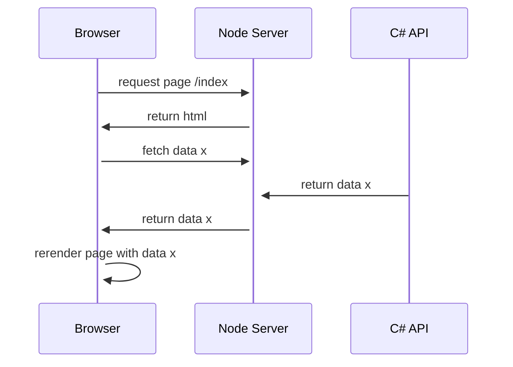
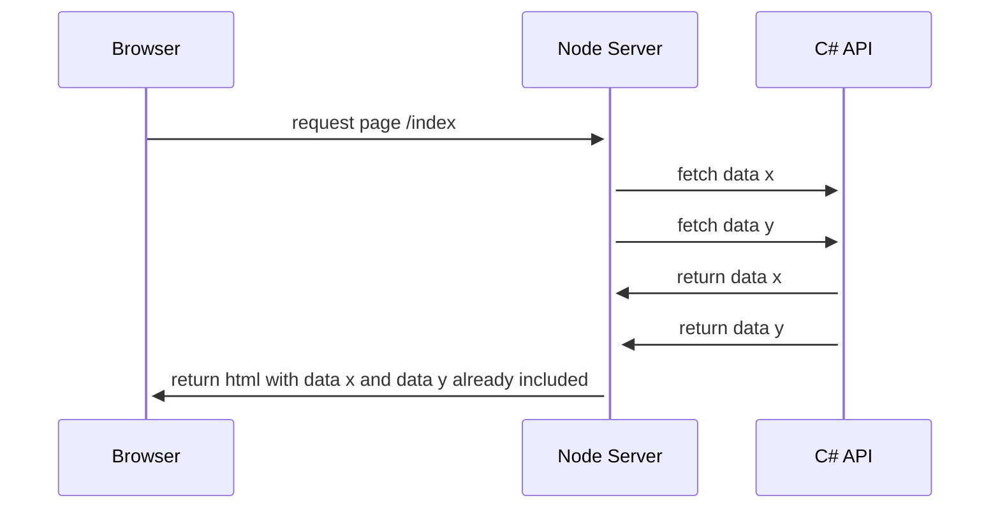

# Introduction

Sample React project

## System Overview

The system contains 3 main components:

- The browser
- The node server
- The C# API

The main technolgoies used are:

- React
- Next.js
- Node.js
- C#

The C# API is only called from the node server. There are no direct calls from the browser to the C# API. To fetch data there are two possibilities:

Fetch data in a `useEffect` hook on the client side. In this scenario the basic web page is already sent to the browser and the data is fetched afterwards. This is the preferred way to fetch data. It's also the way how next.js recommends to fetch data. Because we don't care about SEO we can use the `useEffect` hook to fetch data. If we would care about SEO we would need to use the `getServerSideProps` function. This function is executed on the server side and the data is already available when the page is sent to the browser.

Fetch data in a `useEffect`:



Fetch data in a `getServerSideProps`:



## Debugging the solution

Describe how to debug

### Debug the API

One popular possiblity is using a REST client like [Insomnia](https://insomnia.rest) or [Postman](https://www.postman.com) to make requests to the API.

## Development with VSCode

Describe how to start

## Docker

### Build Docker Container on Windows

Below the commands that are used to build the docker container locally on windows:

- Change to directory `cd Pedalo.UI.API`
- `dotnet restore --packages ../.nuget` (needs only to be run once - this is made to get the neolution nugets from our feed without auth)
- `docker build -t pedalo-api:latest .. -f Dockerfile`

Run container: `docker run --rm -it pedalo-api:latest`
Run container but land in bash for debug: `docker run --rm -it --entrypoint="/bin/bash" pedalo-api:latest`
Run container Dev: `docker run --rm -it pedalo-api:latest -e ASPNETCORE_ENVIRONMENT="Development"`

### Cleanup Docker diskspace on Windows

To view the current space used, run `docker system df` for cleaning up run these commands

- `docker system prune -a --filter label!=do-not-remove`

In powershell start (vm-name or path my be different)

- `Stop-VM DockerDesktopVM`
- `Optimize-VHD -Path "C:\ProgramData\DockerDesktop\vm-data\DockerDesktop.vhdx" -Mode Quick`
- `Start-VM DockerDesktopVM`

## Database migrations

You need to install the Entity Framework Core CLI tools with

`dotnet tool install --global dotnet-ef`

and verify that are correctly installed

`dotnet ef`

Since the solution is splitted in multiple project, we have to specify which one is the "target project" and which is the "startup project" (https://docs.microsoft.com/en-us/ef/core/cli/dotnet#target-project-and-startup-project)

There is a little helper file called `ef.bat` and `ef.sh` (for linux systems) which calls the `dotnet ef` command with the target and startup project already specified:

```batch
@echo off
dotnet ef --project Pedalo.Infrastructure %*
```

So for example instead of writing `dotnet ef --project Pedalo.Infrastructure dbcontext info` we can simply write `ef dbcontext info`

In the following examples we will make use of that helper file.

### Check if the database context is recognized correctly

`ef dbcontext info`

### List all existing database migrations

`ef migrations list`

### Create a new migration

1. Do some changes to the entities and related entity configurations
2. Run command `ef migrations add MigrationName` The migration name can be used like a commit message in a version control system. For example, you might choose a name like AddBlogCreatedTimestamp if the change is a new CreatedTimestamp property on your Blog entity.
3. Review and extend the autogenerated migration file: Pedalo.Infrastructure/Migrations/<datetime>\_MigrationName.cs
4. Apply the migration with the command `ef database update` or set `RuntimeDatabaseMigration=true` in the appsettings.json and run the application
5. Open the generated Migration file and add any permissions or other SQL commands that are required for the migration to be successful. For example, if you add a new table, you might want to add a permission for the web user to access the table.

### Apply all the pending migrations

`ef database update`

### Resetting all migrations

Ref: <https://docs.microsoft.com/en-us/ef/core/managing-schemas/migrations/managing?tabs=dotnet-core-cli#resetting-all-migrations>

In some extreme cases, it may be necessary to remove all migrations and start over. It's also possible to reset all migrations and create a single one without losing your data. This is sometimes called "squashing", and involves some manual work:

- Delete your Migrations folder
- Create a new migration and generate a SQL script for it
  - `ef migrations script`
- In your database, delete all rows from the migrations history table
- Insert a single row into the migrations history, to record that the first migration has already been applied, since your tables are already there. The insert SQL is the last operation in the SQL script generated above.

## Cypress Tests

### How to run the tests locally

1. Run the `pedalo.Tools.DataInitializer` utility if it hasn't run yet
2. Start the `pedalo.UI.API` project
3. Start the `yarn dev` command inside the `\pedalo.UI.Client\` directory
4. Run `yarn cypress:open` inside of `\pedalo.FunctionalTests\`

### Troubleshooting for running cypress tests locally

Sometimes when you start the cypress tests, they need to create or reset the local database. If this fails, you will get an error message saying `Failed to connect to localhost:1433 - Could not connect (sequence)`

- SQL server needs to have the "sa" user configured. Check your cypress.config.ts file for the login credentials
- The SA user needs to be enabled on your local SQL server
- The service **SQL Server Browser** has to be enabled
- The TCP/IP connection needs to be enabled
- In the properties of TCP/IP, the port needs to match with the port in the cypress.config.ts file. (Not `TCP Dynamic Ports`)
