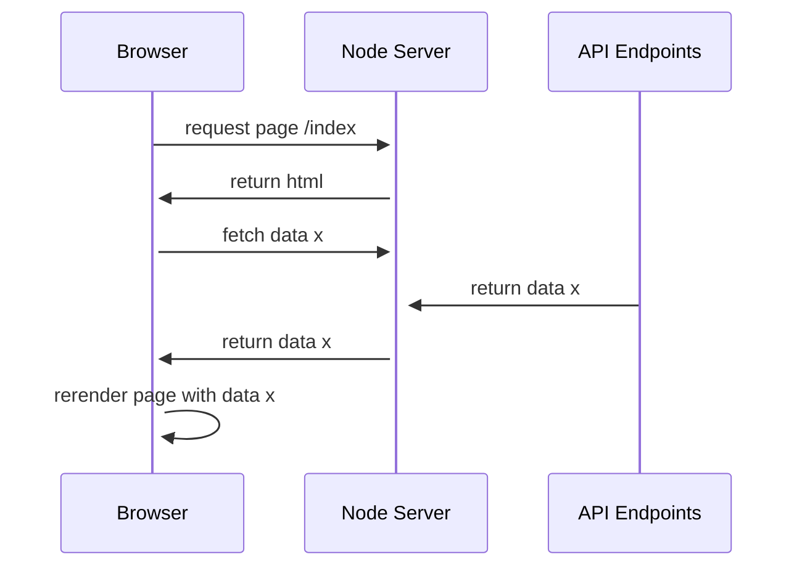
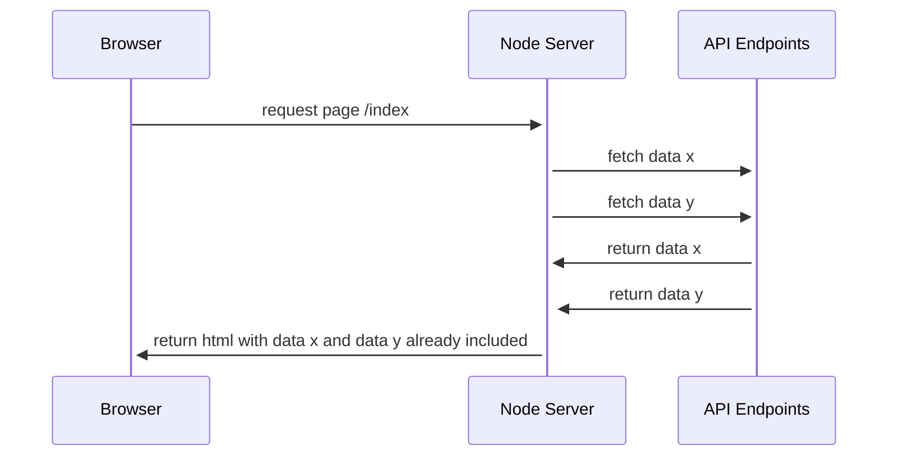

# Pedalo Web App

Sample [LOB](https://en.wikipedia.org/wiki/Line_of_business) web application for a Pedalo rental business using React and ASP.NET Core.

The app has some of the necessary features already implemented:

- Fully working [CRUD](https://en.wikipedia.org/wiki/Create,_read,_update_and_delete) customer management
- Download a PDF fact sheet for each customer
- Overview of the pedalo fleet
- Overview of the past and current bookings
- Switch between German and English as the UI language

Other features still need to be implemented, you can find some of them in the next section.

## Open Tasks

### 1. Implement full CRUD for pedalos and then for bookings

Start with the "update" functionality for pedalos. You can look into the customer management as this functionality is already implemented there. Updating a pedalo should be nearly the same as updating a customer. Next, implement updating a booking, where you need store the relationship between a customer and a pedalo.

After that continue to add the "create" and "delete" pages.

### 2. Add PDF fact sheets to pedalos and bookings

Like with the customer fact sheet, design and add a fact sheet for pedalos and one for bookings. Keep using [QuestPDF](https://www.questpdf.com/). The library is alread used for the customer fact sheet.

### 3. Replace start page with a Dashboard

A dashboard is most likely the starting point for a user and should give the user interesting insights and provide helpful actions for his application and data. Add a "Quick Rent" feature so the user does not have to navigate to the Bookings menu first, but is able to create a booking right from the dashboard.

Also add a table or a graph that shows the business' highest-grossing customers and the most popular pedaloes by calculating numbers from past bookings.

### 4. Improve UX for dates and times

We want the UX to be as nice as possible. Start with dates and times. E.g. make sure the user only needs to enter the times for a new booking, since we can assume the date will usually be todays date. Another example would be the the time of birth of a customer, only the date is relevant, so it should be displayed accordingly.

### 5. Extend functionality and database to allow for passenger registration

Government regulators want to not only know who our customer is, but also what people have accompanied him on his pedalo ride. E.g. when the pedalo goes missing on the water. The water police needs to know how many people to look for. You need to adjust the database design for this change. Here is some advice on how the change can look like.

- Booking still needs always exactly one customer, but now it can have no or multiple passengers
- Passengers must only registered with first and last name
- Max. capacity of passengers for a booking is given by pedalo capacity, minus one (the Customer)

### 6. Send an email receipt

When creating a booking, the user should ask the customer if he wants to receive a receipt for his booking. If the customer confirms, he should have a PDF with his booking details delivered to his email address.

### 7. Add weather widget

Create and render a weather widget either on the dashboard or somewhere in the layout, so it's visible all the time. It should at least show the current temperature. Do not implement an ASP.NET endpoint for this and query the weather API provider directly from the React code. You can find a list of possible providers on [this list](https://github.com/public-apis/public-apis?tab=readme-ov-file#weather).

## Before you start

Finish reading this document to understand the architecture and tools involved to run and develop this software. Then return to the **Open Tasks** section to find the work items we want you to implement next.

## System Overview

The system contains 3 main components:

- The browser
- The node server
- The API endpoints

The main technolgoies used are:

- React
- Next.js
- Node.js
- ASP.NET Core

The API endpoints are only called from the node server. There are no direct calls from the browser to the API endpoints. To fetch data there are two possibilities:

Fetch data in a `useEffect` hook on the client side. In this scenario the basic web page is already sent to the browser and the data is fetched afterwards. This is the preferred way to fetch data. It's also the way how next.js recommends to fetch data. Since this is a LOB application we don't care about SEO and we can therefore use the `useEffect` hook to fetch data. If we would care about SEO we would need to use the `getServerSideProps` function. This function is executed on the server side and the data is already available when the page is sent to the browser.

Fetch data in a `useEffect`:



Fetch data in a `getServerSideProps`:



## Getting started

### Prerequisites

- Node.js LTS
- Yarn
- .NET 8.0 SDK
- Docker

### Setup the database

Run a Microsoft SQL Server instance with Docker

```ps
docker run -e "ACCEPT_EULA=Y" -e "SA_PASSWORD=Test1234!" -p 1433:1433 --name sqlserver -d mcr.microsoft.com/mssql/server
```

If you already have a Microsoft SQL server instance available, make sure to adjust the connection strings `AppDbContext` and `AppDbContextMigration` in all projects of the solution.

Change into the `PedaloWebApp.Tools.DataInitializer` and use `dotnet run` to un the following command to create the database and populate it with sample data:

```ps
dotnet run --project PedaloWebApp.Tools.DataInitializer\PedaloWebApp.Tools.DataInitializer.csproj
```

Note that everytime you run the data initializer the database will be reset and re-initialized with the data.

### Run the backend

This command builds and runs the ASP.NET Core server hosting the API endpoints:

```ps
dotnet run --project PedaloWebApp.UI.Api\PedaloWebApp.UI.Api.csproj
```

### Run the frontend

Change into the `PedaloWebApp.UI.Client` directory and run

```ps
yarn  
```

## Database migrations

You need to install the Entity Framework Core CLI tools with

`dotnet tool install --global dotnet-ef`

and verify that are correctly installed

`dotnet ef`

Since the solution is splitted in multiple project, we have to specify which one is the "target project" and which is the "startup project" (<https://docs.microsoft.com/en-us/ef/core/cli/dotnet#target-project-and-startup-project>)

There is a little helper file called `ef.bat` and `ef.sh` (for linux systems) which calls the `dotnet ef` command with the target and startup project already specified:

```batch
@echo off
dotnet ef --project PedaloWebApp.Infrastructure %*
```

So for example instead of writing `dotnet ef --project PedaloWebApp.Infrastructure dbcontext info` we can simply write `ef dbcontext info`

In the following examples we will make use of that helper file.

### Check if the database context is recognized correctly

`ef dbcontext info`

### List all existing database migrations

`ef migrations list`

### Create a new migration

1. Do some changes to the entities and related entity configurations
2. Run command `ef migrations add MigrationName` The migration name can be used like a commit message in a version control system. For example, you might choose a name like AddBlogCreatedTimestamp if the change is a new CreatedTimestamp property on your Blog entity.
3. Review and extend the autogenerated migration file: `PedaloWebApp.Infrastructure/Migrations/{timestamp}_MigrationName.cs`
4. Apply the migration with the command `ef database update` or set `RuntimeDatabaseMigration=true` in the appsettings.json and run the application
5. Open the generated Migration file and add any permissions or other SQL commands that are required for the migration to be successful. For example, if you add a new table, you might want to add a permission for the web user to access the table.

### Apply all the pending migrations

`ef database update`

### Resetting all migrations

Ref: <https://docs.microsoft.com/en-us/ef/core/managing-schemas/migrations/managing?tabs=dotnet-core-cli#resetting-all-migrations>

In some extreme cases, it may be necessary to remove all migrations and start over. It's also possible to reset all migrations and create a single one without losing your data. This is sometimes called "squashing", and involves some manual work:

- Delete your Migrations folder
- Create a new migration and generate a SQL script for it
  - `ef migrations script`
- In your database, delete all rows from the migrations history table
- Insert a single row into the migrations history, to record that the first migration has already been applied, since your tables are already there. The insert SQL is the last operation in the SQL script generated above.

## Cypress Tests

### How to run the tests locally

1. Run the `PedaloWebApp.Tools.DataInitializer` utility if it hasn't run yet
2. Start the `PedaloWebApp.UI.Api` project
3. Start the `yarn dev` command inside the `\PedaloWebApp.UI.Client\` directory
4. Run `yarn` and then `yarn cypress:open` inside of `\PedaloWebApp.FunctionalTests\`

### Troubleshooting for running cypress tests locally

Sometimes when you start the cypress tests, they need to create or reset the local database. If this fails, you will get an error message saying `Failed to connect to localhost:1433 - Could not connect (sequence)`

- SQL server needs to have the "sa" user configured. Check your cypress.config.ts file for the login credentials
- The SA user needs to be enabled on your local SQL server
- The service **SQL Server Browser** has to be enabled
- The TCP/IP connection needs to be enabled
- In the properties of TCP/IP, the port needs to match with the port in the cypress.config.ts file. (Not `TCP Dynamic Ports`)

## Miscellaneous

### Debug the API

One popular possiblity is using a REST client like [Insomnia](https://insomnia.rest), [Postman](https://www.postman.com) or [Bruno](https://www.usebruno.com) to make requests to the API.

### Build Docker Container on Windows

Below the commands that are used to build the API as a docker container locally on Windows:

- Change to directory `cd PedaloWebApp.UI.Api`
- `dotnet restore --packages ../.nuget` (needs only to be run once - this is made to get the neolution nugets from our feed without auth)
- `docker build -t pedalo-api:latest .. -f Dockerfile`

Run container: `docker run --rm -it pedalo-api:latest`
Run container but land in bash for debug: `docker run --rm -it --entrypoint="/bin/bash" pedalo-api:latest`
Run container Dev: `docker run --rm -it pedalo-api:latest -e ASPNETCORE_ENVIRONMENT="Development"`

### Cleanup Docker diskspace on Windows

To view the current space used, run `docker system df` for cleaning up run these commands

- `docker system prune -a --filter label!=do-not-remove`

In powershell start (vm-name or path my be different)

- `Stop-VM DockerDesktopVM`
- `Optimize-VHD -Path "C:\ProgramData\DockerDesktop\vm-data\DockerDesktop.vhdx" -Mode Quick`
- `Start-VM DockerDesktopVM`
